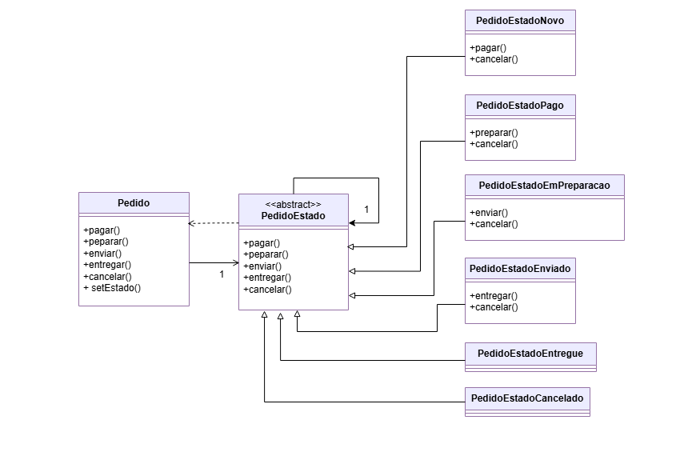

# Implementação do Padrão de Projeto: State

O Padrão State (Estado) é um padrão de projeto comportamental que permite que um objeto altere seu comportamento quando seu estado interno muda, parecendo que o objeto mudou de classe.

Este padrão é ideal para cenários onde a lógica de negócio é fortemente dependente do estado do objeto, eliminando a necessidade de grandes estruturas condicionais e centralizando o comportamento de cada estado em classes separadas.

## Cenário Aplicado: Sistema de Pedidos
Para esta implementação, foi escolhido o cenário de um Sistema de Pedidos, onde um pedido passa por um fluxo de estados bem definido:

Novo → Pago → Em Preparação → Enviado → Entregue (ou Cancelado em qualquer etapa anterior à entrega)

Os componentes principais do padrão, adaptados ao cenário, são:
- **Contexto (Pedido):** O objeto que detém o estado de interesse. Ele mantém uma referência para o objeto de estado atual (PedidoEstado) e delega a ele todas as requisições que dependem do estado
- **Interface/Classe Abstrata de Estado (PedidoEstado):** Define a interface comum para todos os estados
- **Estados Concretos (PedidoEstadoNovo, PedidoEstadoPago, etc...):** Implementam o comportamento específico de cada estado e definem as transições válidas para o próximo estado

### Estrutura do Projeto
O projeto foi organizado utilizando a estrutura padrão do Maven.

```
├──pom.xml
└──src/
    ├── main/java/padroescomportamentais/state/
    │   └── Pedido.java                     # Contexto
    │   └── PedidoEstado.java               # Interface
    │   └── PedidoEstadoNovo.java           
    │   └── PedidoEstadoPago.java               
    │   └── PedidoEstadoEmPreparacao.java               
    │   └── PedidoEstadoEnviado.java               
    │   └── PedidoEstadoEntregue.java               
    │   └── PedidoEstadoCancelado.java               
    └── test/java/padroescomportamentais/state/
        └── PedidoTest.java  
```

### Diagrama


### Tecnologias Utilizadas
- Java 11: Linguagem de programação principal.
- Maven 3.8+: Ferramenta de automação de build e gerenciamento de dependências.
- JUnit 5: Framework para a escrita e execução de testes unitários.